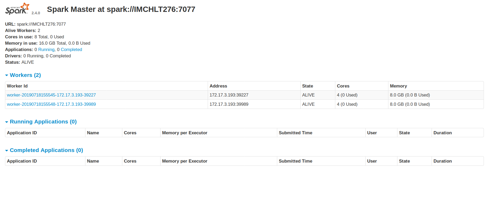

# spark-tpcds

A comprehensive suit to explore Spark performance tuning experiments.


### [Standalone Setup](https://jaceklaskowski.gitbooks.io/mastering-apache-spark/spark-standalone-example-2-workers-on-1-node-cluster.html)
Download the latest version from [here](https://spark.apache.org/downloads.html).
and Unzip to /some/path/spark-x.y.z-bin-hadoop2.7/
```
cd /some/path/spark-x.y.z-bin-hadoop2.7/
cp conf/spark-defaults.conf.template conf/spark-defaults.conf
cp conf/slaves.template conf/slaves
cp conf/spark-env.sh.template conf/spark-env.sh
vim conf/spark-env.sh #My machine has 12 cores and 32GB RAM
    SPARK_WORKER_CORES=4
    SPARK_WORKER_MEMORY=8g
    SPARK_WORKER_INSTANCES=2
sbin/start-all.sh #this should start two workers in yor machine
sbin/stop-all.sh #to stop 
```

Check your [Spark UI](http://localhost:8080/)!




### Build

```
gradle jar
```

### How to run ?

**Generate Data**
```
spark-submit \
--master spark://IMCHLT276:7077 \
--executor-memory 8G \
--total-executor-cores 8 \
--class com.dhiraa.spark.tpcds.TPCDSDatagen \
build/libs/spark-tpcds.jar \
--output-location /tmp/tpcds/ \
--scale-factor 1 \
--partition-tables \
--format parquet 
```

**Run TPCSDS Query Suite**
```
spark-submit \
--conf spark.sql.crossJoin.enabled=true \
--conf spark.sql.autoBroadcastJoinThreshold=-1 \
--master spark://IMCHLT276:7077 \
--executor-memory 8G \
--total-executor-cores 8 \
--class org.apache.spark.sql.execution.benchmark.TPCDSQueryBenchmark \
build/libs/spark-tpcds.jar \
--tpcds-data-location /tmp/tpcds/ \
--out-data-location /tmp/tpcds_results \
--query-filter q3,q5,q6,q7,q9,q13,q15,q17,q20,q25,q28,q29,q37,q44,q46,q48,q49,q50,a51,q52,q61,q68,q70,q73,q78,q79,q80,q82,q87,q88,q96,q97
```

**Generate And BenchMark**
```
export FACTOR=1
export TPSDS_DATA_PATH=/tmp/tpcds/$FACTOR/
export TPSDS_RESULT_PATH=/tmp/tpcds/$FACTOR/results/

spark-submit \
--conf spark.sql.crossJoin.enabled=true \
--conf spark.sql.autoBroadcastJoinThreshold=-1 \
--master spark://IMCHLT276:7077 \
--executor-memory 8G \
--total-executor-cores 8 \
--class com.dhiraa.spark.tpcds.TPSDSGenerateNBenchmark \
build/libs/spark-tpcds.jar \
--output-location $TPSDS_DATA_PATH \
--scale-factor $FACTOR \
--partition-tables \
--format parquet \
--tpcds-data-location $TPSDS_DATA_PATH \
--out-data-location $TPSDS_RESULT_PATH \
--query-filter q3,q5,q6,q7,q9,q13,q15,q17,q20,q25,q28,q29,q37,q44,q46,q48,q49,q50,a51,q52,q61,q68,q70,q73,q78,q79,q80,q82,q87,q88,q96,q97
```


**Spark Lens**
```
```

**Custom Listeners**
```
export FACTOR=1
export TPSDS_DATA_PATH=/tmp/tpcds/$FACTOR/
export TPSDS_RESULT_PATH=/tmp/tpcds/$FACTOR/results/

spark-submit \
--conf spark.sql.crossJoin.enabled=true \
--conf spark.sql.autoBroadcastJoinThreshold=-1 \
--master spark://IMCHLT276:7077 \
--executor-memory 8G \
--total-executor-cores 8 \
--class com.dhiraa.spark.tpcds.TPSDSGenerateNBenchmark \
build/libs/spark-tpcds.jar \
--output-location $TPSDS_DATA_PATH \
--scale-factor $FACTOR \
--partition-tables \
--format parquet \
--tpcds-data-location $TPSDS_DATA_PATH \
--out-data-location $TPSDS_RESULT_PATH \
--query-filter q3,q5,q6,q7,q9,q13,q15,q17,q20,q25,q28,q29,q37,q44,q46,q48,q49,q50,a51,q52,q61,q68,q70,q73,q78,q79,q80,q82,q87,q88,q96,q97

```
### Ambari Setup
- https://docs.hortonworks.com/HDPDocuments/Ambari-2.7.3.0/bk_ambari-installation/content/ambari_repositories.html
- https://www.youtube.com/watch?v=KgungC9I6XM
- https://docs.hortonworks.com/HDPDocuments/Ambari-2.2.0.0/bk_Installing_HDP_AMB/content/_edit_the_host_file.html

```
cat ~/.ssh/id_rsa.pub >> ~/.ssh/authorized_keys
chmod 600 ~/.ssh/authorized_keys

sudo vim /etc/hosts #add following two lines
    127.0.0.1 localhost.localdomain localhost
    
    ::1 localhost6.localdomain6 localhost6
 
sudo wget -O /etc/apt/sources.list.d/ambari.list http://public-repo-1.hortonworks.com/ambari/ubuntu18/2.x/updates/2.7.3.0/ambari.list
sudo apt-key adv --recv-keys --keyserver keyserver.ubuntu.com B9733A7A07513CAD
sudo apt-get update 
sudo apt-cache showpkg ambari-server 
sudo apt-cache showpkg ambari-agent
sudo apt-cache showpkg ambari-metrics-assembly
sudo apt-get install ambari-server
ambari-server setup
ambari-server start
ambari-server status
```

**References**
- https://medium.com/google-cloud/data-catalog-hands-on-guide-a-mental-model-dae7f6dd49e
