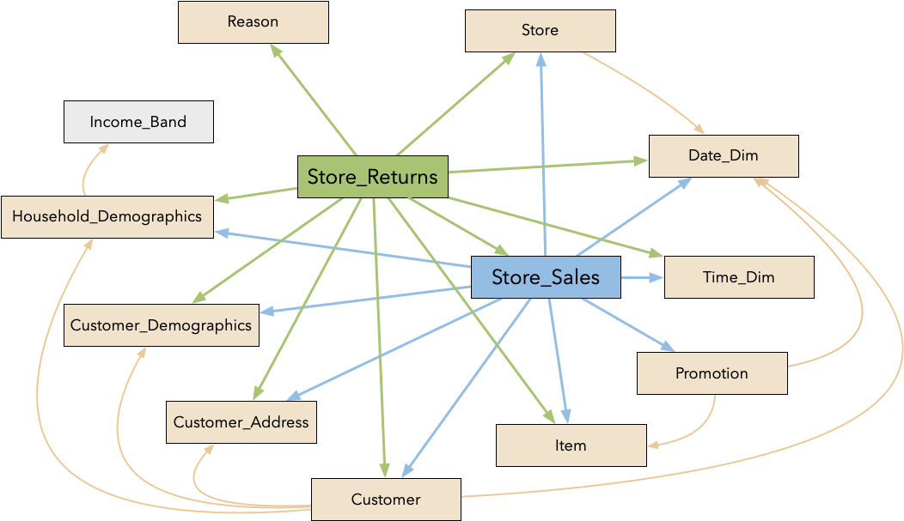
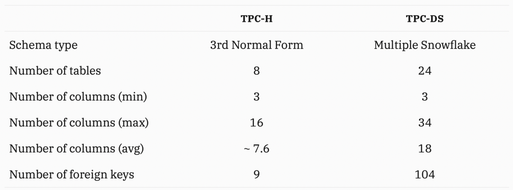
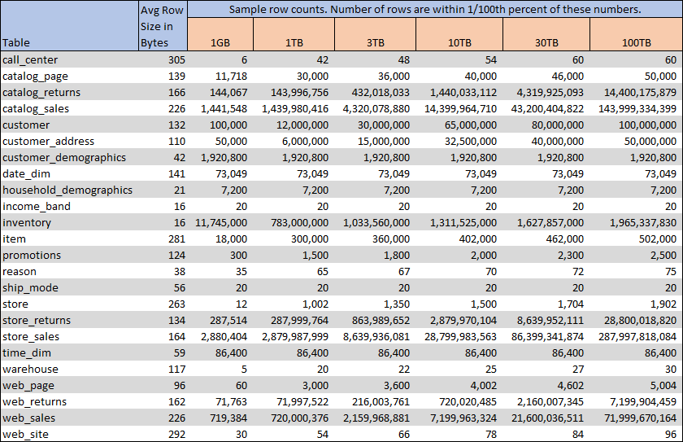
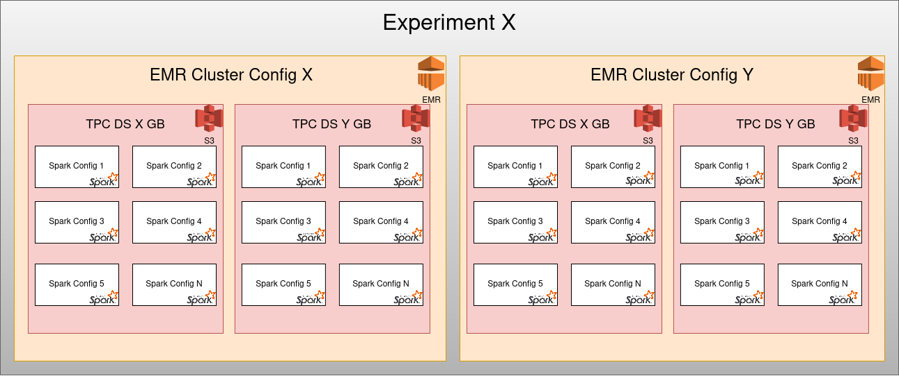

# spark-tpcds

A simple suit to explore Spark performance tuning experiments.

Please visit the original [TPS-DS](http://www.tpc.org/tpcds/) site for more details. 
This repo is fork of databricks TPC-DS, with added support of running over `spark-submit`, 
giving more control to developers for further modification as and when needed.  

TPC-DS is the de-facto industry standard benchmark for measuring the performance of decision support solutions including, 
but not limited to, Big Data systems. The current version is v2. It models several generally applicable aspects of a decision 
support system, including queries and data maintenance. Although the underlying business model of TPC-DS is a retail 
product supplier, the database schema, data population, queries, data maintenance model and implementation rules have 
been designed to be broadly representative of modern decision support systems.

This benchmark illustrates decision support systems that:

    - Examine large volumes of data
    - Give answers to real-world business questions
    - Execute queries of various operational requirements and complexities (e.g., ad-hoc, reporting, iterative OLAP, data mining)
    - Are characterized by high CPU and IO load
    - Are periodically synchronized with source OLTP databases through database maintenance functions
    - Run on “Big Data” solutions, such as RDBMS as well as Hadoop/Spark based systems

Read this [blog](https://medium.com/hyrise/a-summary-of-tpc-ds-9fb5e7339a35) for more info on decision support systems.







Workload

The simulated workload is the core of any benchmark. In TPC-DS it is split into two components:

- Query workload
  TPC-DS specifies a set of 99 distinct SQL-99 queries (including OLAP extensions), which are designed to cover the entire dataset
  - pure reporting queries
  - pure ad-hoc queries
  - iterative OLAP queries
  - extraction or data mining queries
    
- Data maintenance workload

Both aspects are vital to a DSS: Data maintenance operations synchronize data between operational systems and the data warehouse, whereas queries convert operational facts into some business intelligence.


- [Specification](http://www.tpc.org/tpc_documents_current_versions/current_specifications.asp)
- [tpc-ds_v2.1.0.pdf](http://www.tpc.org/tpc_documents_current_versions/pdf/tpc-ds_v2.1.0.pdf)
- [Schema](https://gerardnico.com/data/type/relation/benchmark/tpcds/schema)
- [Making of TPC DS Paper](https://www.researchgate.net/publication/221311196_The_Making_of_TPC-DS)


## Benchmark Experiments

As with any experiment, Spark TPC-DS benchmark also comes with a lot of knobs that can be tweaked.



Following list comprises high level yet important knobs that can be tweaked.

- TPC-DS data
    - Format
    - Size
    - Number of partitions
    - Column partition
- EMR Cluster Configuration
    - Core and Task Node Types
    - Number of Core and Task Nodes
    - Network speed
    - EBS size
    - HDFS support
- Apache Spark Software Configuration
    - Executor configuration
        - Number of executors
        - Number Cores
        - Memory
    - Adaptive Query Engine
    
The whole infrastructure can be provisioned by Pulumi IaC library. Check [here](emn) for more details. 


### [Standalone Setup](https://jaceklaskowski.gitbooks.io/mastering-apache-spark/spark-standalone-example-2-workers-on-1-node-cluster.html)
Download the latest version from [here](https://spark.apache.org/downloads.html).
and Unzip to /some/path/spark-x.y.z-bin-hadoop2.7/
```
cd /path/to/spark-x.y.z-bin-hadoopx.y/
cp conf/spark-defaults.conf.template conf/spark-defaults.conf
cp conf/slaves.template conf/slaves
cp conf/spark-env.sh.template conf/spark-env.sh
vim conf/spark-env.sh #My machine has 12 cores and 32GB RAM

SPARK_WORKER_CORES=4
SPARK_WORKER_MEMORY=8g
SPARK_WORKER_INSTANCES=2

sbin/start-all.sh #this should start two workers in yor machine
sbin/stop-all.sh #to stop 
```

Check your [Spark UI](http://localhost:8080/)


### Build

```
gradle jar
```

### How to run ?

**Generate Query**
[Reference](https://github.com/databricks/tpcds-kit#query-generation)

```
cd src/main/resources/tpcds-v2.13.0/
./dsqgen \
-DIRECTORY query_templates \
-INPUT query_templates/templates.lst \
-VERBOSE Y \
-QUALIFY Y \
-SCALE 10000 \
-DIALECT netezza \
-OUTPUT_DIR ../../../tpcds-v2.13.0/
```


**Generate Data**  

1. Using binary in local mode
    [dsdgen](src/main/resources/binaries/Linux/x86_64/)
    
```
Options:
General Options
===============
ABREVIATION =  <s>       -- build table with abreviation <s>
DIR =  <s>               -- generate tables in directory <s>
HELP =  <n>              -- display this message
PARAMS =  <s>            -- read parameters from file <s>
QUIET =  [Y|N]           -- disable all output to stdout/stderr
SCALE =  <n>             -- volume of data to generate in GB
TABLE =  <s>             -- build only table <s>
UPDATE =  <n>            -- generate update data set <n>
VERBOSE =  [Y|N]         -- enable verbose output
PARALLEL =  <n>          -- build data in <n> separate chunks
CHILD =  <n>             -- generate <n>th chunk of the parallelized data
RELEASE =  [Y|N]         -- display the release information
FILTER =  [Y|N]          -- output data to stdout
VALIDATE =  [Y|N]        -- produce rows for data validation
_CHILD_ONLY =  [Y|N]     -- output the child table only

Advanced Options
===============
DELIMITER =  <s>         -- use <s> as output field separator
DISTRIBUTIONS =  <s>     -- read distributions from file <s>
FORCE =  [Y|N]           -- over-write data files without prompting
SUFFIX =  <s>            -- use <s> as output file suffix
TERMINATE =  [Y|N]       -- end each record with a field delimiter
VCOUNT =  <n>            -- set number of validation rows to be produced
VSUFFIX =  <s>           -- set file suffix for data validation
RNGSEED =  <n>           -- set RNG seed
```

```
cd src/main/resources/binaries/Linux/x86_64/

```


2. Distributed mode using Spark 
Example: 
  - For 5GB scale, table `catalog_sales` doesn't support parallel generation.
    `./dsdgen -table catalog_sales -filter Y -scale 5 -RNGSEED 100 -parallel 100 -child 2`
  - However for 8GB scale, table `catalog_sales` supports parallel generation.
    `./dsdgen -table catalog_sales -filter Y -scale 8 -RNGSEED 100 -parallel 100 -child 99`
    
```
spark-submit \
--master spark://IMCHLT276:7077 \
--executor-memory 2G \
--executor-cores 2 \
--total-executor-cores 8 \
--class com.dhiraa.spark.tpcds.TPCDSDataGenerator \
build/libs/spark-tpcds.jar \
--output-location /tmp/tpcds2h/ \
--scale-factor 10 \
--format parquet 
```

**Run TPCSDS Query Suite**
```
spark-submit \
--conf spark.sql.crossJoin.enabled=true \
--conf spark.sql.autoBroadcastJoinThreshold=-1 \
--master spark://IMCHLT276:7077 \
--executor-memory 2G \
--executor-cores 2 \
--total-executor-cores 8 \
--class org.apache.spark.sql.tpcds.TPCDSQueryBenchmark \
build/libs/spark-tpcds.jar \
--tpcds-data-location /tmp/tpcds2i \
--out-data-location /tmp/tpcds_results2i \
--query-filter q3,q5,q6,q7,q9,q13,q15,q17,q20,q25,q28,q29,q37,q44,q46,q48,q49,q50,a51,q52,q61,q68,q70,q73,q78,q79,q80,q82,q87,q88,q96,q97
```

**Generate And BenchMark**
```
export FACTOR=1
export TPSDS_DATA_PATH=/tmp/tpcds/$FACTOR/
export TPSDS_RESULT_PATH=/tmp/tpcds/$FACTOR/results/

spark-submit \
--conf spark.sql.crossJoin.enabled=true \
--conf spark.sql.autoBroadcastJoinThreshold=-1 \
--master spark://IMCHLT276:7077 \
--executor-memory 8G \
--total-executor-cores 8 \
--class com.dhiraa.spark.tpcds.TPSDSGenerateNBenchmark \
build/libs/spark-tpcds.jar \
--output-location $TPSDS_DATA_PATH \
--scale-factor $FACTOR \
--partition-tables \
--format parquet \
--tpcds-data-location $TPSDS_DATA_PATH \
--out-data-location $TPSDS_RESULT_PATH \
--query-filter q3,q5,q6,q7,q9,q13,q15,q17,q20,q25,q28,q29,q37,q44,q46,q48,q49,q50,a51,q52,q61,q68,q70,q73,q78,q79,q80,q82,q87,q88,q96,q97
```


**[Spark Lens](https://github.com/qubole/sparklens)**
```
export FACTOR=1
export TPSDS_DATA_PATH=hdfs://imaginealabscluster/user/mageswarand/tpcds/$RUN_ID/
export TPSDS_RESULT_PATH=hdfs://imaginealabscluster/user/mageswarand/tpcds/$RUN_ID/results/

spark-submit \
--conf spark.sql.crossJoin.enabled=true \
--conf spark.sql.autoBroadcastJoinThreshold=-1 \
--packages qubole:sparklens:0.3.0-s_2.11 \
--conf spark.extraListeners=com.qubole.sparklens.QuboleJobListener \
--conf spark.sparklens.data.dir=
--master spark://IMCHLT276:7077 \
--executor-memory 8G \
--total-executor-cores 8 \
--class com.dhiraa.spark.tpcds.TPSDSGenerateNBenchmark \
build/libs/spark-tpcds.jar \
--output-location $TPSDS_DATA_PATH \
--scale-factor $FACTOR \
--partition-tables \
--format parquet \
--tpcds-data-location $TPSDS_DATA_PATH \
--out-data-location $TPSDS_RESULT_PATH \
--query-filter q3,q5,q6,q7,q9,q13,q15,q17,q20,q25,q28,q29,q37,q44,q46,q48,q49,q50,a51,q52,q61,q68,q70,q73,q78,q79,q80,q82,q87,q88,q96,q97
```

**Code Reference:**
- This repo uses the binary compiled from Databricks [tpcds-kit](https://github.com/databricks/tpcds-kit)
- The data generation code is a fork of Databricks [spark-sql-perf](https://github.com/databricks/spark-sql-perf)
- Spark benchmark example code is used for metric collection


**References**
- https://github.com/IBM/spark-tpc-ds-performance-test
- https://github.com/databricks/spark-sql-perf
- https://github.com/maropu/spark-tpcds-datagen
- [Spark SQL Test suite](https://github.com/apache/spark/tree/master/sql/core/src/test/scala/org/apache/spark/sql/execution/benchmark)
- https://medium.com/google-cloud/data-catalog-hands-on-guide-a-mental-model-dae7f6dd49e
- https://developer.ibm.com/patterns/explore-spark-sql-and-its-performance-using-tpc-ds-workload/

**Blogs**
- https://databricks.com/session/spark-sql-2-0-experiences-using-tpc-ds
- https://www.youtube.com/watch?v=CvZ7QelRFak
- https://aws.amazon.com/blogs/big-data/performance-updates-to-apache-spark-in-amazon-emr-5-24-up-to-13x-better-performance-compared-to-amazon-emr-5-16/
- https://medium.com/@rhbutani/https-medium-com-oracle-snap-benefits-of-bi-semantics-in-spark-sql-a-view-through-the-tpcds-benchmark-5cca8d6d25d2
- https://db-blog.web.cern.ch/blog/luca-canali/2017-06-diving-spark-and-parquet-workloads-example
- How to use Databricks `spark-sql-perf` in cluster?
    - https://www.bluegranite.com/blog/generate-big-datasets-with-databricks
    - https://xuechendi.github.io/2019/07/12/Prepare-TPCDS-For-Spark
- Spark 3 AQE
    - https://docs.databricks.com/spark/latest/spark-sql/aqe.html
    - https://databricks.com/blog/2020/05/29/adaptive-query-execution-speeding-up-spark-sql-at-runtime.html
    - https://databricks.com/blog/2020/06/18/introducing-apache-spark-3-0-now-available-in-databricks-runtime-7-0.html
    - https://software.intel.com/content/www/us/en/develop/articles/spark-sql-adaptive-execution-at-100-tb.html
    - [Experiment with Movielens Dataset](https://medium.com/@ravishankar.nair/adaptive-query-execution-aqe-in-spark-3-with-example-what-every-spark-programmer-must-know-adfde0dc600e)
    - [Expriment](https://github.com/phatak-dev/spark-3.0-examples)  [Blog1](http://blog.madhukaraphatak.com/spark-aqe-part-1/)  [Blog2](http://blog.madhukaraphatak.com/spark-aqe-part-1/)
    - https://www.unraveldata.com/resources/catalyst-analyst-a-deep-dive-into-sparks-optimizer/
    - https://www.agilelab.it/spark-3-0-first-hands-on-approach-with-adaptive-query-execution-part-3/
    - https://www.waitingforcode.com/apache-spark-sql/what-new-apache-spark-3-adaptive-query-execution/read
    - https://blog.cloudera.com/how-does-apache-spark-3-0-increase-the-performance-of-your-sql-workloads/

