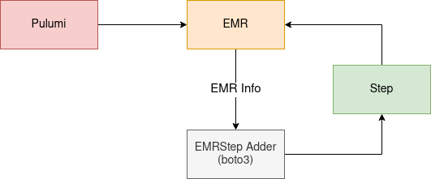

# Infrastructure as Code

We are using [Pulumi](https://www.pulumi.com/) for provisioning AWS EMR infrastructure from python code.

Check [here](https://www.pulumi.com/docs/get-started/aws/begin/) for Pulumi install steps.

Note: Only the current user machine is allowed to login by default




```
export AWS_ACCESS_KEY_ID=<YOUR_ACCESS_KEY_ID>
export AWS_SECRET_ACCESS_KEY=<YOUR_SECRET_ACCESS_KEY>

conda activate <YOUR_ENV>
curl -sSL https://get.pulumi.com | sh
pip install -r requirements.txt

pulumi stack ls # list all stacks

pulumi init select spark-tpcds-emr-exp1 # initialize the stack if not done already

pulumi stack select spark-tpcds-emr-exp1 # select the required one

pulumi up # to setup EMR

pulumi stack output --json # to list all ID's

pulumi destroy # to terminate EMR cluster 
```
